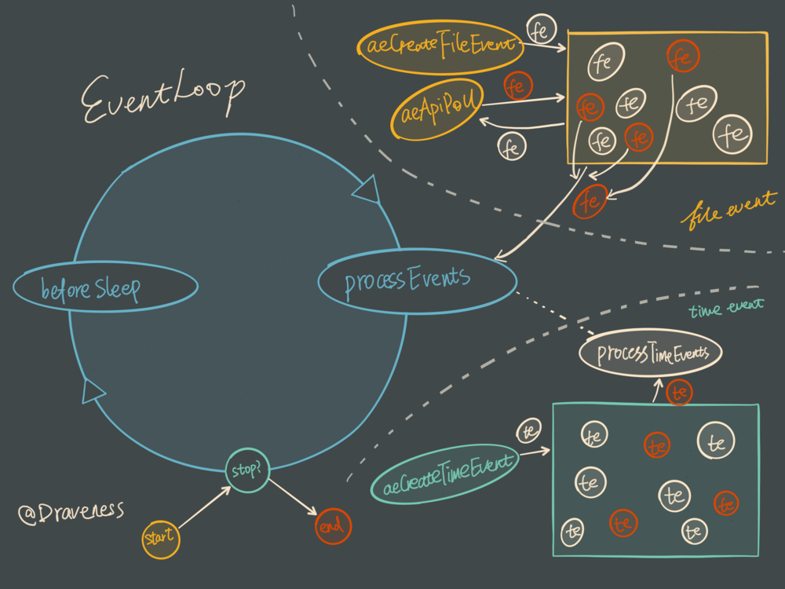

### eventloop  redis入口
[知乎关于多路复用](https://www.zhihu.com/question/28594409/answer/74003996)
#### 普通阻塞i/o
通常i/o操作是阻塞I/O，但你调用read时，如果没有数据收到，那么线程或者进程就会被挂起，直到收到数据。
如果有1000个线程和服务器交互，那么需要需要1000个线程来处理这些请求，
而cpu的核数一般就是4，8，16，32，64，128，如果是4核跑1000个线程，
那么每个线程的时间槽非常短，线程切换特别频繁
有两个问题
+ 线程是有内存开销的，1个线程需要512k(或2m)来保存，那么1000个线程就要512M(或2G)内存来保存。
+ 线程的切换，上下文切换是有cpu开销，当大量时间都是在切换，分配给真正操作的cpu就要少很多。
#### IO多路复用
多路复用使用一个线程检查多个文件描述符（Socket）的就绪状态。
比如调用select和poll函数，传入多个文件描述符，如果有一个文件描述符就绪，则返回，否则阻塞直到超时
。得到就绪状态后进行真正的操作可以在同一个线程里执行，也可以启动线程执行（比如使用线程池）。

这样在处理1000个连接时，只需要1个线程监控就绪状态
，对就绪的每个连接开一个线程处理就可以了，这样需要的线程数大大减少，减少了内存开销和上下文切换的CPU开销。


文件时间处理与套接字相关的工作，
在aeEventLoop中以数组的形式保存，redis.conf中可以设置maxClients，
根据这个配置分配数组的大小，对应fd的时间就保存 在events[fd]中，因为fd会按照从小到大分配



#### 推荐阅读
[多路复用](https://draveness.me/redis-io-multiplexing/)

### client
tcp是流式协议，不能保证输入输出的完整性，所以需要维护连接的状态，主要是输入和输出缓冲区。
tcp 网络编程需要自己设定通信协议，常见的有
+ 以分割符划分完整的元素。如 \r\n
+ header+content 结构。 header 一般保存着content的长度，header可以是固定字节长度或者按照分隔符划分。
#### redis中client如何和server端通信
redis中使用`resp`协议通信，详见[文档](https://redis.io/topics/protocol)
`resp`其实是一种序列话协议，一些数据类型取决于第一个字节

type |  encoding
--- | ---
Simple String | `+{content}\r\n`
Error | `-{error type} {content}\r\n`
Integer | `:{number}\r\n`
Bulk String | `${length}\r\n{content}\r\n`
Array | `*{array length}\r\n{各类型元素} 重复 array length次数`
举个例子，client发送一个命令给server端`llen mylist`，获取列表mylist的长度
`*2\r\n$4\r\nLLEN\r\n$6\r\nmylist\r\n`
`*2`是Array,然后`$4\r\nLLEN`是`BULK STRING`，长度是4，content是LLEN,后面同上。
#### redis客户端发送命令分为两张
+ A client sends to the Redis server a RESP Array consisting of just Bulk Strings.
+ inline command: space-separated arguments 


### dict
[美团点评](https://tech.meituan.com/2018/07/27/redis-rehash-practice-optimization.html)

### ziplist
其实是一个超长的字符串a'c'c

分为
header  entry entry entry   end（255 特殊标识位）

entry会保存1.当前的编码2.当前entry的字符串，3.前一个entry的长度，以便通过指针移动，到达前一个entry,
4.保存当前entry的长度，效果同上


字符串移动 指针如何实现，看下一个


```text
 * The general layout of the ziplist is as follows:
 * <zlbytes><zltail><zllen><entry><entry><zlend>
 *
 * <zlbytes> is an unsigned integer to hold the number of bytes that the
 * ziplist occupies. This value needs to be stored to be able to resize the
 * entire structure without the need to traverse it first.
 * // 保存ziplist所占字节数
 *
 * <zltail> is the offset to the last entry in the list. This allows a pop
 * operation on the far side of the list without the need for full traversal.
 * // <zltail>是列表中最后一个条目的偏移量。这允许在列表的另一端进行弹出操作，而无需完全遍历。
 *
 * <zllen> is the number of entries.When this value is larger than 2**16-2,
 * we need to traverse the entire list to know how many items it holds.
 * // entry的数量，如果超过 2**16-2.我们需要才能知道数目
 * <zlend> is a single byte special value, equal to 255, which indicates the
 * end of the list.
 * // 单字节特殊数组，等于255，表示列表的末尾
```


### c语言中字符串移动
可以通过指针的移动举例
```c
    char *pointer = "https://www.baidu.com";
    pointer+=2;
    printf("%s",pointer);
    // 输出是tps://www.baidu.com
```